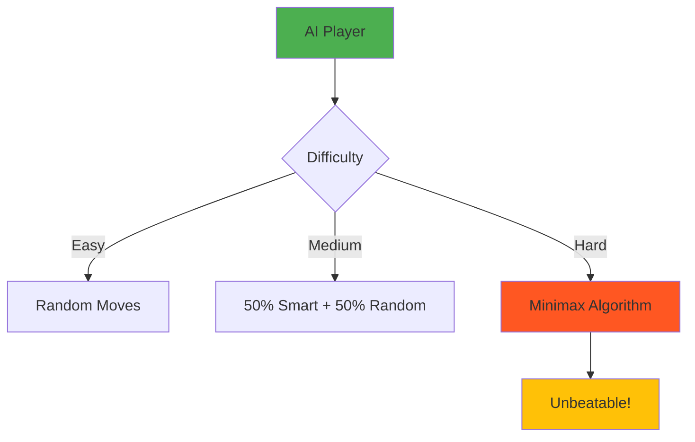
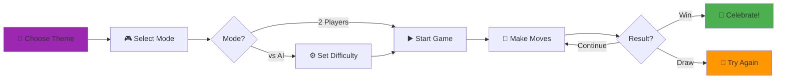
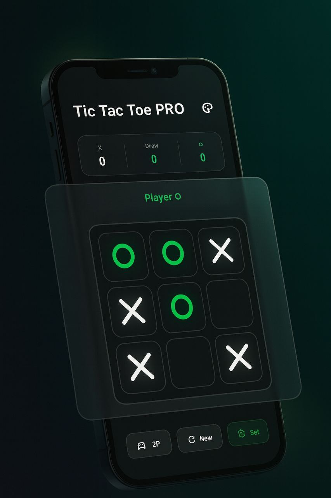
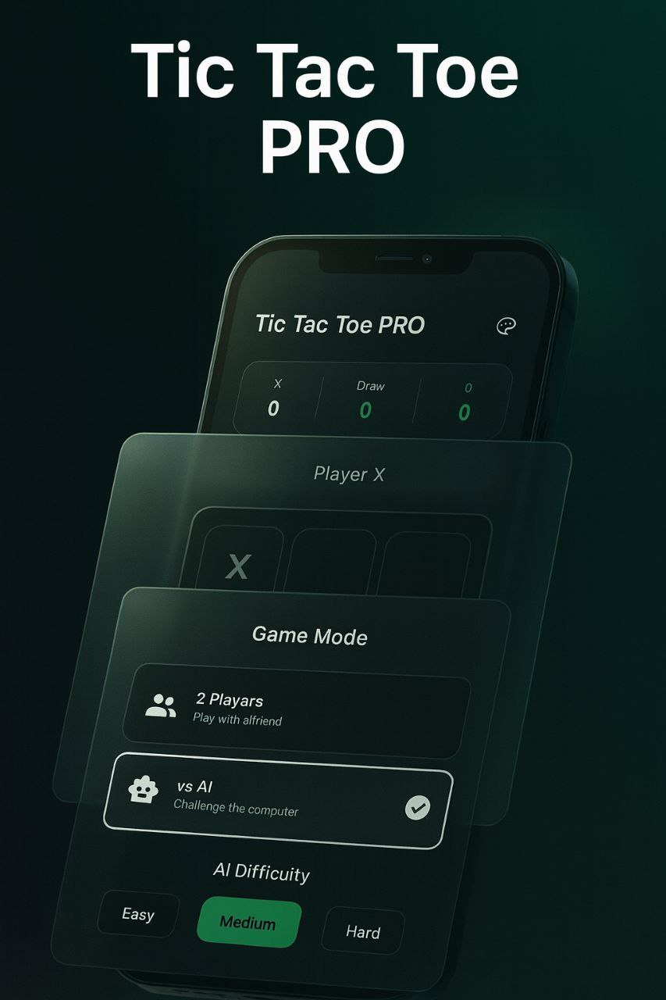
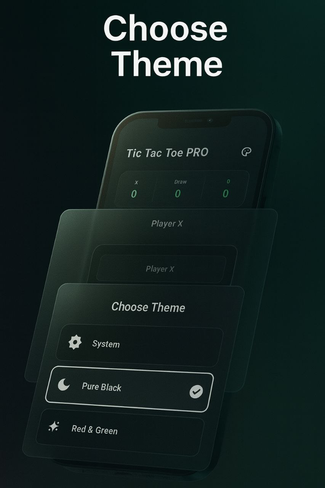

<div align="center">

# 🎮 Tic Tac Toe


### 🌟 A Modern, Beautiful Tic Tac Toe Game with AI 🌟

*Experience the classic game reimagined with stunning themes, intelligent AI, and smooth animations*

[📥 Download](#-installation) • [✨ Features](#-features) • [🎨 Themes](#-themes) • [🎯 Play Now](#-how-to-play)

---


*Beautiful UI with smooth animations*

</div>

---

## 🌈 Highlights

<div align="center">

| 🎨 **4 Themes** | 🤖 **Smart AI** | ✨ **Animations** | 📊 **Tracking** |
|:---:|:---:|:---:|:---:|
| Auto-adaptive | 3 Difficulties | Smooth & Fluid | Score History |

</div>

---

## ✨ Features

<table>
<tr>
<td width="50%" valign="top">

### 🎨 **Stunning Visual Themes**

<details>
<summary>🌓 <b>System Theme</b> - Smart Adaptation</summary>
<br>
Automatically switches between light and dark mode based on your device settings. Perfect for users who want seamless integration with their system preferences.
</details>

<details>
<summary>⚫ <b>Pure Black</b> - OLED Optimized</summary>
<br>
Elegant pure black background with crisp white text. Designed for OLED displays to save battery and reduce eye strain in dark environments.
</details>

<details>
<summary>⚪ <b>Pure White</b> - Clean & Minimal</summary>
<br>
Pristine white background with sharp black text. Perfect for bright environments and users who prefer light themes.
</details>

<details>
<summary>🎨 <b>Red & Green</b> - Vibrant Colors</summary>
<br>
Eye-catching red X and green O on dark background. Brings energy and excitement to every game with bold, contrasting colors.
</details>

</td>
<td width="50%" valign="top">

### 🤖 **Intelligent AI Opponent**



**🧠 Minimax Algorithm Features:**
- ✅ Evaluates all possible game states
- ✅ Calculates optimal move strategy
- ✅ Guarantees best possible outcome
- ✅ Impossible to beat on Hard mode

**🎯 Perfect for:**
- 🟢 **Easy** - Learning the game
- 🟡 **Medium** - Casual practice
- 🔴 **Hard** - Ultimate challenge

</td>
</tr>
</table>

---

## 🎮 Game Modes

<div align="center">

| Mode | Description | Best For |
|:----:|:------------|:---------|
| 👥 **2 Players** | Local multiplayer on same device | Playing with friends & family |
| 🤖 **vs AI** | Challenge the computer | Solo practice & skill building |

</div>

---

## 🚀 Installation

### 📋 Prerequisites

```bash
✅ Flutter SDK: >=3.7.2
✅ Dart SDK: Latest
✅ Android Studio / VS Code
✅ Android Device or Emulator
```

### ⚡ Quick Setup

<table>
<tr>
<td>

**Step 1: Clone**
```bash
git clone https://github.com/abhishek0112cs221008/TIC-_TAC-_TOE.git
cd TIC-_TAC-_TOE
```

</td>
<td>

**Step 2: Install**
```bash
flutter pub get
```

</td>
<td>

**Step 3: Run**
```bash
flutter run
```

</td>
</tr>
</table>

---

## 🎨 Themes Showcase

<div align="center">

| Theme | Background | Primary | Accent | Perfect For |
|:-----:|:----------:|:-------:|:------:|:------------|
| 🌓 **System** | Auto | Auto | Blue | Adaptive users |
| ⚫ **Pure Black** | `#000000` | `#FFFFFF` | Green | OLED displays |
| ⚪ **Pure White** | `#FFFFFF` | `#000000` | Red | Bright rooms |
| 🎨 **Red & Green** | `#000000` | Red/Green | White | Color lovers |

</div>

---

## 💎 Advanced Features

<table>
<tr>
<td width="33%" align="center">

### 📊 **Score Tracking**
Real-time statistics  
X wins • O wins • Draws  
Persistent storage  
Reset anytime

</td>
<td width="33%" align="center">

### ✨ **Smooth Animations**
Scale & rotation effects  
Glow on winning cells  
Confetti celebration  
Fluid transitions

</td>
<td width="33%" align="center">

### ⚙️ **Customization**
Sound effects toggle  
Haptic feedback  
Theme switching  
AI difficulty

</td>
</tr>
</table>

---

## 🎯 How to Play

<div align="center">



</div>

### 📝 Step-by-Step Guide

1. **🎨 Choose Your Theme**
   - Tap the palette icon in the top-right
   - Select from 4 beautiful themes
   - Watch the smooth transition

2. **🎮 Select Game Mode**
   - Tap the mode button at bottom
   - Choose 2 Players or vs AI
   - Set AI difficulty if needed

3. **🎲 Play the Game**
   - Tap any empty cell to place your symbol
   - Watch the smooth scale & rotate animation
   - Try to get three in a row!

4. **🏆 Win & Celebrate**
   - Winning cells glow with special effects
   - Enjoy the confetti celebration
   - Check your updated score

---

## 🛠️ Tech Stack

<div align="center">

### Core Technologies

| Technology | Version | Purpose |
|:-----------|:-------:|:--------|
|  | 3.7.2+ | Cross-platform UI framework |
|  | Latest | Programming language |
|  | 6.1.1 | State management |

### Key Packages

```yaml
dependencies:
  provider: ^6.1.1          # State management
  audioplayers: ^6.5.1      # Sound effects
  confetti: ^0.8.0          # Victory animation
  flutter_animate: ^4.5.0   # Smooth animations
  google_fonts: ^6.2.1      # Poppins typography
```

</div>

---

## 📁 Project Architecture

```
📦 TIC-_TAC-_TOE
├── 📂 lib/
│   ├── 📂 models/
│   │   ├── 🎮 game_mode.dart          # Game mode enum (2P/AI)
│   │   └── 📊 game_stats.dart         # Score tracking model
│   ├── 📂 providers/
│   │   └── 🔄 game_provider.dart      # State management with Provider
│   ├── 📂 screens/
│   │   └── 🖼️ game_screen.dart        # Main game UI screen
│   ├── 📂 services/
│   │   └── 🤖 ai_player.dart          # AI logic with minimax algorithm
│   ├── 📂 theme/
│   │   └── 🎨 app_theme.dart          # Theme system (4 themes)
│   ├── 📂 widgets/
│   │   ├── 🎲 game_board.dart         # 3x3 game board widget
│   │   └── ⭕ game_cell.dart          # Cell with custom X/O painters
│   └── 🚀 main.dart                    # App entry point
├── 📂 assets/
│   └── 📂 audio/
│       ├── 🔊 move_sound.mp3          # Move sound effect
│       └── 🎵 win_sound.mp3           # Victory sound
└── 📄 README.md                        # You are here!
```

---

## 🎓 Learning Outcomes

<div align="center">

| Concept | Implementation |
|:--------|:---------------|
| 🎨 **Theming** | Custom theme system with 4 variants + system theme |
| 🔄 **State Management** | Provider pattern for reactive UI updates |
| 🎭 **Custom Painting** | Hand-drawn X and O with glow effects |
| 🤖 **AI Algorithms** | Minimax algorithm for unbeatable gameplay |
| ✨ **Animations** | Scale, rotation, and particle effects |
| 🎵 **Audio** | Sound effects with audioplayers package |
| 📊 **Data Persistence** | In-memory score tracking |

</div>

---

## 📸 Screenshots

<div align="center">

 &nbsp;&nbsp;
 &nbsp;&nbsp;
 &nbsp;&nbsp;


</div>

---

## 🤝 Contributing

Contributions make the open-source community amazing! Any contributions are **greatly appreciated**.

<details>
<summary><b>How to Contribute</b></summary>

1. 🍴 Fork the Project
2. 🌿 Create your Feature Branch (`git checkout -b feature/AmazingFeature`)
3. ✍️ Commit your Changes (`git commit -m 'Add some AmazingFeature'`)
4. 📤 Push to the Branch (`git push origin feature/AmazingFeature`)
5. 🎉 Open a Pull Request

</details>

---

## 📜 License

Distributed under the MIT License. See `LICENSE` for more information.

---

## 👨‍💻 Developer

<div align="center">

### Abhishek

**Computer Science Student | Flutter Developer**

[](https://github.com/abhishek0112cs221008)
[](mailto:abhishek0112cs221008@gmail.com)

*Building beautiful mobile experiences with Flutter* 💙

</div>

---

## 🙏 Acknowledgments

- 🎮 Classic Tic Tac Toe for the timeless gameplay
- 🧠 Minimax algorithm for AI intelligence
- 🎨 Modern mobile design trends for inspiration
- 💙 Flutter community for amazing packages

---

<div align="center">

### ⭐ Star this repository if you found it helpful!

**Made with ❤️ and Flutter**

[](https://github.com/abhishek0112cs221008/TIC-_TAC-_TOE/stargazers)

[⬆️ Back to Top](#-tic-tac-toe)

</div>

---

<div align="center">
<sub>© 2024 Abhishek. All rights reserved.</sub>
</div>